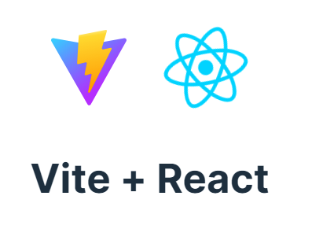

Vite is a fast and modern build tool for creating web applications. It increases the development process by providing faster build times and better performance. 



- Install React with vite
    ``` bash
    npm create vite@latest demo
    ```
    - Selection Framework - React
    - Select Variant - Javascript
- Install Dependencies
    ```bash
    npm install 
    ```
- Start the server 
    ```bash
    npm run dev
    ```
- Bootstrap IntelliSense Plugin can be used for suggestion in VSCode